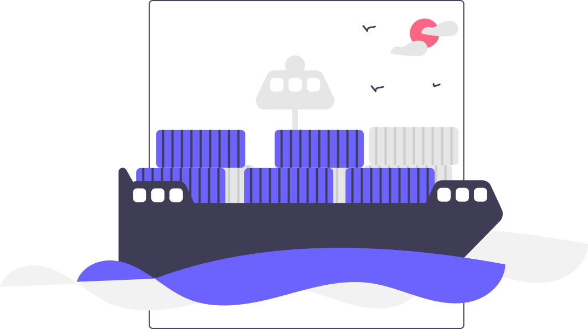

<h1 align="center">
    
</h1>

# docker-compose

This repository provides a containerized Shopware example deployment using docker-compose.

## :warning: Disclaimer

A Kubernetes deployment is already in work!

## :bulb: Features

### Shopware

* MySQL Database Service
* PHP-FPM Service
* Nginx Service
* Redis HTTP-Caching Service
* Redis Session Management Service
* Redis Cart Persistence Service
* Redis User Module Activity Service
* Redis Message Queue Status Service
* Redis Remote Lock Store Service
* Redis Consecutive Number State Service
* RabbitMQ Message Queue Service
* Varnish Reverse HTTP Cache Service
* Elasticsearch Service

### Logging (ELK Stack)

* Elasticsearch Service
* Logstash Service
* Filebeat Service
* Kibana Service

## :rocket: Deployment

Clone the repository and its submodules

```bash
git clone --recursive git@github.com:sw-in-containers/docker-compose.git
```

To deploy the Docker environment, run

```bash
make start
```

Next, set up a simple Shopware instance with some test data

```bash
docker exec -it docker-compose-php-fpm-1 /bin/sh
bin/console system:install --create-database --basic-setup -f
bin/console store:download -p SwagPlatformDemoData
bin/console plugin:refresh
bin/console plugin:install --activate SwagPlatformDemoData
bin/console cache:clear && bin/console cache:warmup
```

You can now access the Shop by visiting `http://localhost` and the Kibana dashboard by visiting `http://localhost:5601`.

## Feel like contributing?

Read our [contribution guidelines](CONTRIBUTING.md) and create
an [issue](https://github.com/sw-in-containers/docker-compose/issues/new/choose) or
a [pull request](https://github.com/sw-in-containers/docker-compose/compare).

## License

This project is licensed under the [MIT](LICENSE) license.
Feel free to do whatever you want with the code!
